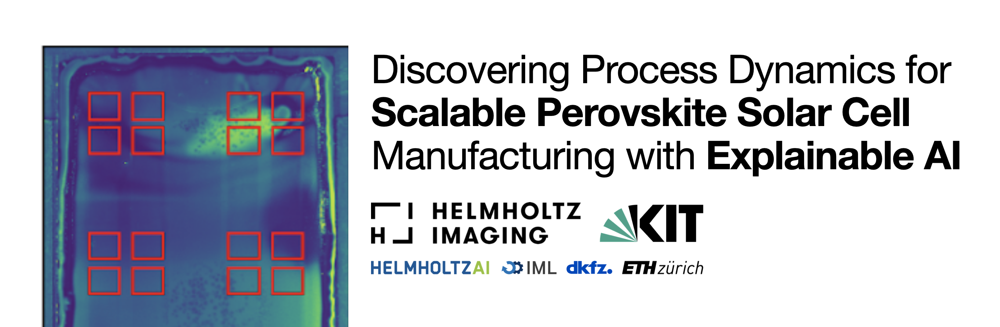
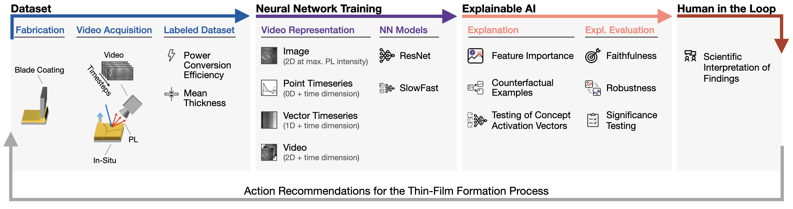
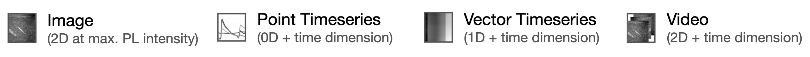

<br />
<p align="center">
  <a href=" ">
     
  </a>

  <h1 align="center">Discovering Process Dynamics for Scalable Perovskite Solar Cell Manufacturing with Explainable AI</h1>

  <p align="center">
    <a href="https://www.python.org/"></a>
    <a href="https://pytorch.org/get-started/locally/"></a>
    <a href="https://pytorchlightning.ai/"></a>
    <a href="https://black.readthedocs.io/en/stable"></a>
    <br>
    <a href="https://doi.org/10.1002/adma.202307160"><strong>Read the paper »</strong></a>
    <br />
  </p>
</p>

This study uses explainable AI to analyze photoluminescence data from perovskite thin-film processing, linking it to solar cell performance, and offering actionable insights for scalable solar cell manufacturing.

> Abstract: <br>*Large-area processing of perovskite semiconductor thin-films is complex and evokes unexplained variance in quality, posing a major hurdle for the commercialization of perovskite photovoltaics. Advances in scalable fabrication processes are currently limited to gradual and arbitrary trial-and-error procedures. While the in-situ acquisition of photoluminescence videos has the potential to reveal important variations in the thin-film formation process, the high dimensionality of the data quickly surpasses the limits of human analysis. In response, this study leverages deep learning and explainable artificial intelligence (XAI) to discover relationships between sensor information acquired during the perovskite thin-film formation process and the resulting solar cell performance indicators, while rendering these relationships humanly understandable. We further show how gained insights can be distilled into actionable recommendations for perovskite thin-film processing, advancing towards industrial-scale solar cell manufacturing. Our study demonstrates that XAI methods will play a critical role in accelerating energy materials science.*

<br>

<p align="center">
   
</p>

## 📝&nbsp;&nbsp;Citing this Work

If you use perovskite-xai please cite our [paper](https://doi.org/10.1002/adma.202307160)

```bibtex
@article{https://doi.org/10.1002/adma.202307160,
  author = {Klein, Lukas and Ziegler, Sebastian and Laufer, Felix and Debus, Charlotte and Götz, Markus and Maier-Hein, Klaus and Paetzold, Ulrich W. and Isensee, Fabian and Jäger, Paul F.},
  title = {Discovering Process Dynamics for Scalable Perovskite Solar Cell Manufacturing with Explainable AI},
  journal = {Advanced Materials},
  volume = {n/a},
  number = {n/a},
  pages = {2307160},
  keywords = {deep learning, energy materials science, explainable artificial intelligence (XAI), knowledge discovery, perovskite solar cells},
  doi = {https://doi.org/10.1002/adma.202307160},
  url = {https://onlinelibrary.wiley.com/doi/abs/10.1002/adma.202307160},
  eprint = {https://onlinelibrary.wiley.com/doi/pdf/10.1002/adma.202307160},
}
```

<br>

## 🧭&nbsp;&nbsp;Table of Contents
* [Installation](#Installation)
* [Project Structure](#project-structure)
* [Dataset](#dataset)
* [Reproducing the Results](#reproducing-the-results)
* [Acknowledgements](#acknowledgements)

<br>

## ⚙️&nbsp;&nbsp;Installation

perovskite-xai requires Python version 3.9 or later. All essential libraries for the execution of the code are provided in the `requirements.txt` file from which a new environment can be created (Linux only):

```bash
git clone https://github.com/IML-DKFZ/repo
cd perovskite-xai
conda create -n perovskite-xai python=3.9
source activate perovskite-xai
pip install -r requirements.txt
```

Depending on your GPU, you need to install an appropriate version of PyTorch and torchvision separately. All scripts run also on CPU, but can take substantially longer depending on the experiment. Testing and development were done with the Pytorch version using CUDA 11.6. 

<br>

## 🗃&nbsp;&nbsp;Project Structure

<p align="center">
   
</p>

```text
├── base_model.py                   - Pytorch Ligthning Module defining the training pipeline              
├── data                            - 
│   ├── add_new_labels.py           - 
│   ├── augmentations               - Augmentation policies for the 1/2/3 dimensional representations
│   ├── cv_splits.py                - Creating the Cross Validation splits
│   ├── perovskite_dataset.py       - Pytorch Dataset Definition of the different representations
│   ├── preprocessing.py            - Preprocessing of the original hdf5 files to numpy
│   └── split_data.py               - Definition of the train/test split of the data
├── main.py                         - Entry point incl. CLI for training a model on the perovskite data 
├── models                          -
│   ├── resnet.py                   - ResNet implmentations for 1/2/3 dimensional inputs
│   └── slowfast.py                 - SlowFast implementation
├── predict_from_checkpoint.py      -
├── predict_testset.py              - Evaluation of the trained models on the held out testset
├── preprocessed                    - 
├── README.md                       -
├── requirements.txt                - Requirements file for running the code
├── utils.py                        - Multiple utility functions for model loading, logging etc.
└── xai                             
    ├── images                      - Figure export location
    ├── results                     - Interim data export location
    ├── src                         
    │   ├── attribution             - Attribution computation & visualization
    │   ├── counterfactuals         - CF computation & visualization
    │   ├── evaluation              - Evaluation computation & visualization
    │   └── tcav                    - TCAV computation & visualization
    ├── utils                       - util scripts for evaluation
    └── util_vis                    
        ├── util_error_vis.ipynb    - Residual and parity plots
        └── util_vis.ipynb          - Various paper figures
```
## 💾&nbsp;Dataset
<p align="center">
  <br>
  Representations
</p>

The dataset can be downloaded [**here**](https://doi.org/10.5281/zenodo.7503391).<br>
After downloading, run `./data/split_data.py` to obtain the here used train/test split.
Use `./data/preprocessing.py` to extract the data from the h5 files and save the videos as numpy arrays and the respective labels in csv files. Afterwards, you can run `./data/cv_splits.py` on the preprocessed train data if you want to use the same Cross Validation splits we used.


## ♻️&nbsp;Reproducing the Results
### 🚀&nbsp;Model Training

<br>

### 🔎&nbsp;XAI Computation
**Feature Importance** <br>
Open the folder `./xai/src/attribution`. This folder contains ipython notebooks for attribution computation and  attribution visualization. There is one notebook per modality and for local or global attribution computation (global attribution only if possible for this modality). The paths to the respective model weights and datasets have to be set. Further the respective target (`target = "mth" or "pce"`) has to be selected. Global attribution computation (*n=100*) and the rendering of the GIF for 3D Video attribution can take some time. 

**Counterfactual Examples** <br>
Open the folder `./xai/src/counterfactuals`. This folder contains ipython notebooks for CF computation and visualization. There is one notebook per modality and the paths to the respective model weights and datasets have to be set. The default selected observations to compute and visualize the CF is the one shown in the paper. Further the respective target (`target = "mth" or "pce"`) has to be selected. The computation for 3D video CFs can take substantial time. Thus the results are exportet into the `./xai/results` folder before (GIF) visualization.

**TCAV** <br>
Run the script `./xai/src/tcav/tcav_1D.py` with the `data_dir`, `checkpoint_dir` and `target` arguments submitted to the parser. For example:

```bash
python ./xai/src/tcav/tcav_1D.py --data_dir="path/to/data" --checkpoint_dir="path/to/checkpoints" --target="mth"
```

The script runs the whole TCAV pipeline:

1. Concept sampling
2. Linear model training and CAV extraction
3. CAV testing on selected model layers
4. Figure creation and export

<br>

### 📊&nbsp;XAI Evaluation
Open the folder `./xai/src/evaluation`. In this folder are four scripts for the evaluation of the attribution maps for each modality. Set the `data_dir` and `checkpoint_dir` among other hyperparameter in the argument parser when running the scripts. For example:

```bash
pyhton ./xai/src/evaluation/eval_1D --data_dir="path/to/data" --checkpoint_dir="path/to/checkpoints" --batch_size=500 --target="pce"
```

The script computes the attribution maps and evaluates them for `n = batch_size` observations. The results are exportet as `.npz` compressed arrays to `./xai/results/`. The results can be visualized by the `eval_plot.ipynb` notebook. Only the target (`target = "mth" or "pce"`) and modality (dim = "1D", "2D_time", "2D_image" or "3D") have to be specified. 

<br>

## 📣&nbsp;&nbsp;Acknowledgements

The code is developed by the authors of the paper. However, it does also contain pieces of code from the following packages:

- Captum by Kokhlikyan, Narine et al.: https://github.com/pytorch/captum
- DiCE by Mothilal, Ramaravind K. et al.: https://github.com/interpretml/DiCE
- Image Classification by Ziegler, Sebastian: https://github.com/MIC-DKFZ/image_classification

____

<br>

<p align="center">
   &nbsp;&nbsp;&nbsp;&nbsp;
   &nbsp;&nbsp;&nbsp;&nbsp;
   &nbsp;&nbsp;&nbsp;&nbsp;
   &nbsp;&nbsp;&nbsp;&nbsp; 
  
</p>

perovskite-xai is developed and maintained by the Interactive Machine Learning Group and the Applied Computer Vision Lab of [Helmholtz Imaging](https://www.helmholtz-imaging.de/) and the [DKFZ](https://www.dkfz.de/de/index.html), as well as the Light Technology Institute of the [Karlsruhe Institute of Technology](https://www.lti.kit.edu/index.php) and [Helmholtz AI](https://www.helmholtz.ai/).